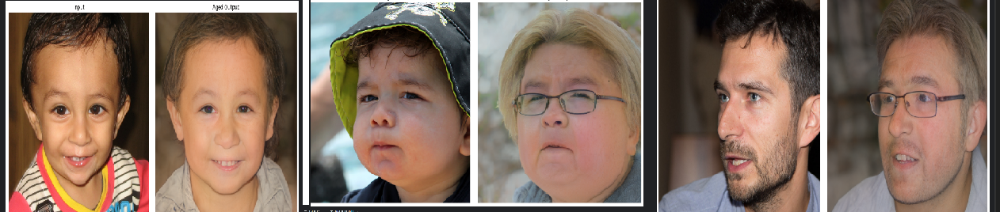

# 👤 Age Regression & Progression System (StyleGAN2 + Latent Adapter)

A deep learning system for **identity-preserving facial age transformation** using StyleGAN2 latent-space editing and a custom-trained latent adapter.

<p align="center">
  
</p>

---

## 🚀 Overview

This project implements a practical face age editing pipeline that learns structured transformations in latent space instead of relying on direct pixel-space generation.

The system takes a real face image, encodes it into StyleGAN2 latent space, applies a learned age-edit direction, and generates a new face that is either **younger** or **older** while preserving identity as much as possible.

---

## ✨ Key Features

- 🔁 **Age Regression** and **Age Progression**
- 🧠 **Latent-space editing in W+**
- 🧍 **Identity preservation** with IR-SE50
- 🎯 **Strength-controlled edits**
- ⚡ **Fast inference after loading**
- 🧩 **Modular training and inference pipeline**
- 🔬 Built for research, experimentation, and portfolio use

---

## 🧱 System Architecture

```text
Input Image
    │
    ▼
Face Alignment (FFHQ-style)
    │
    ▼
SAM / pSp Encoder
    │
    ▼
W+ Latent Code
    │
    ▼
Latent Adapter (ΔW)
    │
    ▼
W + αΔW (Controlled Edit)
    │
    ▼
StyleGAN2 Generator (FFHQ)
    │
    ▼
Aged / Regressed Output

📂 Project Structure

age_regression_progression/

```text
├── train_adapter.py          # Training pipeline
├── inference_pipeline.py     # Inference pipeline
├── ffhq_align.py             # FFHQ-style face alignment
├── diagnose_samples.py       # Debugging and validation helper
├── test_reconstruct.py       # Reconstruction utility
├── utils.py                  # Model loading utilities

├── models/                   # Pretrained models (not included)
├── checkpoints/              # Trained adapter checkpoints
├── input_images/             # Test inputs
├── output_images/            # Generated outputs
├── assets/                   # README images and figures
└── README.md

🚀 How It Works

The pipeline uses a pretrained encoder to map an input face into latent space.
A trainable adapter then predicts a latent delta that represents an age edit direction.

Instead of generating a face from scratch, the model edits the latent code:

W_new = W + αΔW

Where:

W = original latent code
ΔW = predicted age direction
α = edit strength

This makes the output controllable and fast at inference time.

🧠 Core Components
1. StyleGAN2 FFHQ Generator

Generates high-quality facial images from latent codes.

2. SAM / pSp Encoder

Encodes real input faces into the StyleGAN latent space.

3. Latent Adapter

A lightweight neural network that learns age-related transformations in W+ space.

4. IR-SE50 Identity Model

Used to preserve facial identity during training.

5. Age Supervision

Used to guide the edit direction and keep age changes semantically meaningful.

```text
models/
├── sam_ffhq_aging.pt
├── stylegan2-ffhq-config-f.pt
├── dex_age_classifier.pth
└── model_ir_se50.pth

Pretrained weights are not included in this repository.

📊 Output

The system generates face edits that aim to:

preserve identity
change apparent age
maintain realistic facial structure
keep transitions smooth and natural

Example outputs may include:

younger-looking faces with smoother skin
older-looking faces with more mature structure
changes in hair texture, wrinkles, and facial shape

🧪 Training Strategy

The adapter is trained using latent-space supervision with a combination of:

latent delta prediction
identity preservation
cycle consistency
perceptual regularization
edit strength control

The goal is to learn a stable age transformation direction in W+ space.

Notes
Training works best on aligned FFHQ-style faces
Smaller batch sizes reduce memory pressure
Checkpoints are saved automatically
Mid-epoch checkpoints can be used for recovery

⚡ Performance Notes
Inference is lightweight once the models are loaded
Training on full-resolution 1024×1024 faces can be memory intensive
256×256 training is more stable for adapter learning
Output quality depends heavily on face alignment and checkpoint maturity
🧰 Debugging Tools
diagnose_samples.py

Used to inspect:

predicted age values
latent delta magnitude
identity similarity
output consistency
ffhq_align.py

Used to align face crops before encoding so the encoder sees a more consistent face layout.

🔮 Future Improvements
Better layer-wise latent control
Stronger identity preservation for extreme age edits
Higher-resolution inference optimization
More robust age supervision
Web UI / Gradio frontend
FastAPI deployment
Better evaluation metrics for age shift quality
📌 Important Notes
Works best on frontal, aligned faces
Extreme age changes may reduce identity fidelity
Faces outside the FFHQ distribution may require stronger alignment
The project is intended for research and learning purposes
📌 Tech Stack
Python
PyTorch
StyleGAN2
OpenCV
NumPy
LPIPS
IR-SE50
Face alignment utilities
⚠️ Disclaimer

This project is intended for educational, research, and portfolio use only.

It is not intended for misuse, impersonation, or harmful manipulation of personal images.

👨‍💻 Author

Pranjal Singh
B.Tech CSE

Computer Vision • Generative AI • Deep Learning Systems

📧 pranjalpratap2580@gmail.com

🌐 https://www.linkedin.com/in/pranjal-singh-19b980316/

